# 모바일에서 클레이튼 NFT 확인하기

## 모바일에서 클레이튼 NFT 확인하기 &#x20;

모바일 메타마크스에 카이카스를 가져와 모바일 오픈씨 어플리케이션을 통하여 보유 nft목록을 확인할 것 입니다.

준비물 : 메타마스크 어플리케이션, 오픈씨 어플리케이션

### 1. 모바일 메타마스크로 카이카스  가져오기  &#x20;

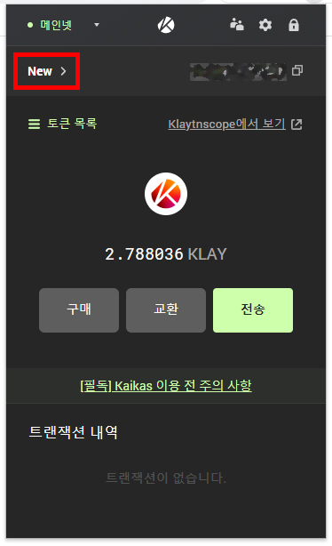

카이카스 좌측상단의 지갑이름을 클릭합니다.

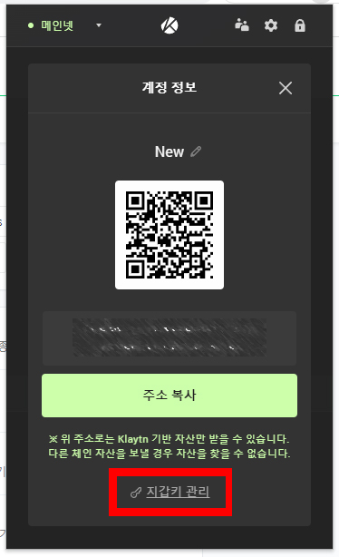

하단의 지갑키 관리를 클릭하여 줍니다.

.jpg>)

지갑키 내보내기를 눌러줍니다.

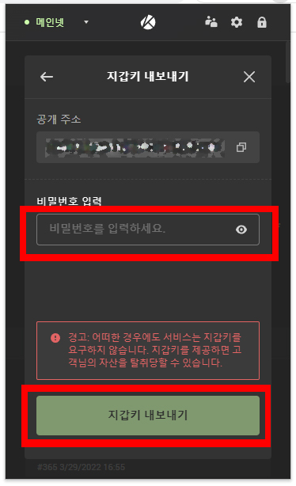

비밀번호를 입력한 후 지갑키 내보내기를 눌러줍니다.

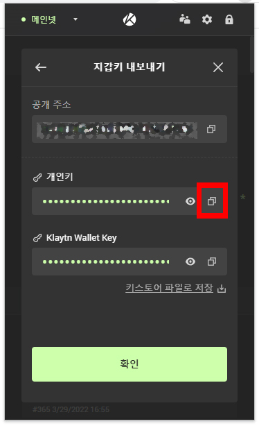

개인키를 복사합니다.

개인키는 타인에게 넘어가지 않도록 매우 조심하여야 합니다.

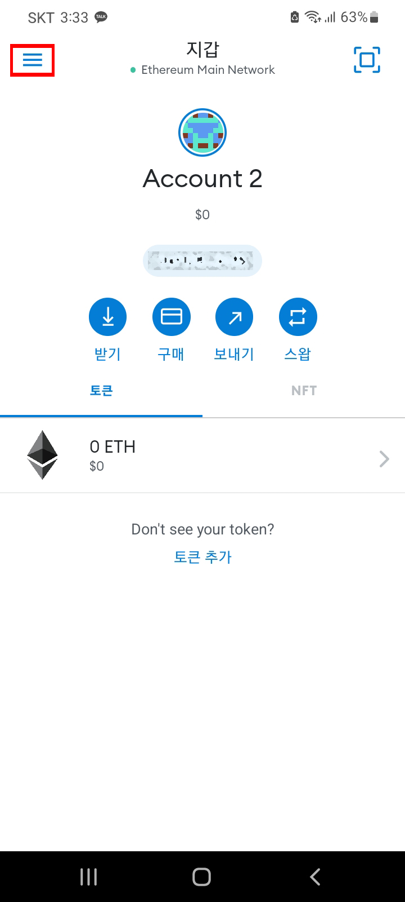

모바일 메타마스크를 켠 뒤 좌측상단의 메뉴버튼을 눌러줍니다.

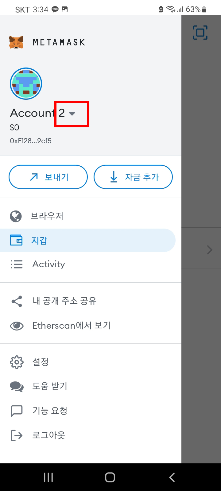

계정목록을 펼쳐줍니다.

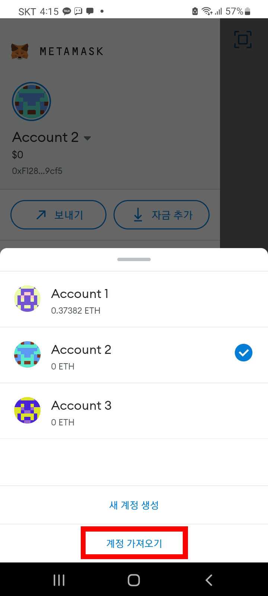

계정 가져오기를 클릭합니다. 아까 복사한 개인키를 붙여넣기 합니다.   &#x20;

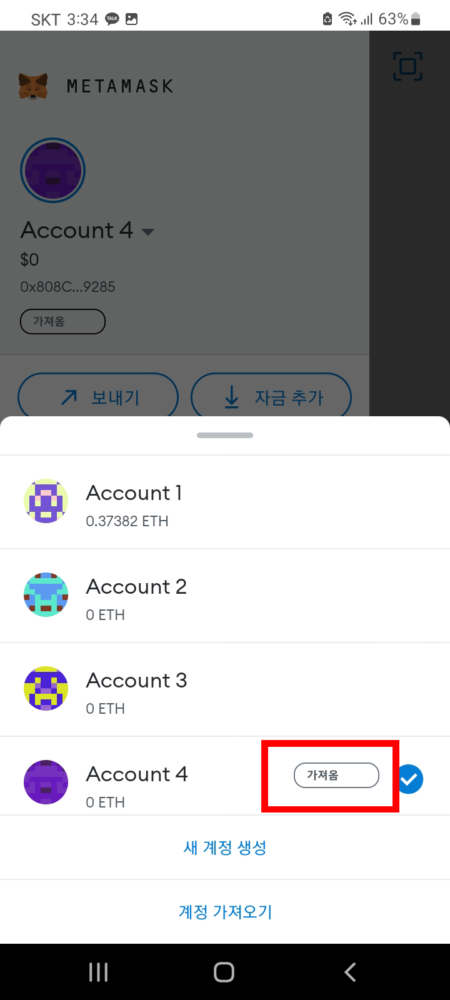

개인키를 붙여넣고 나면 카이카스 계정이 가져와집니다.

### 2. 모바일 오픈씨에서 NFT 확인하기 &#x20;

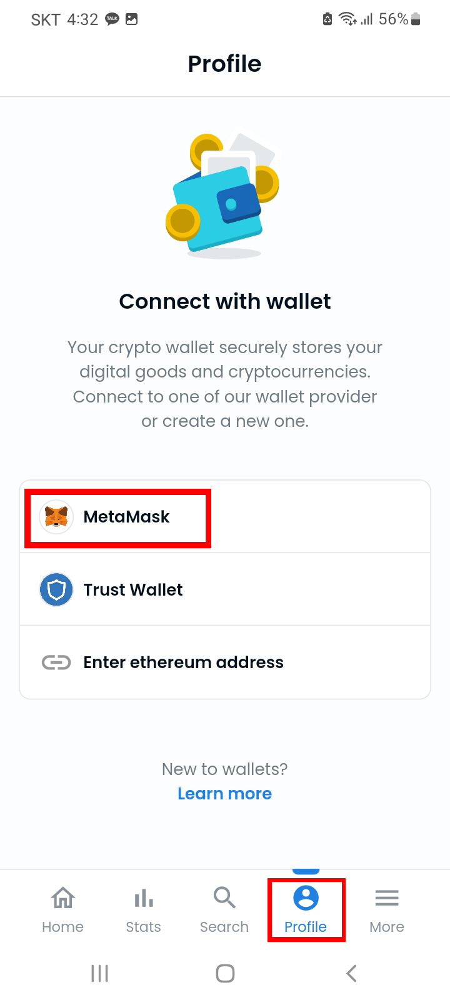

오픈씨 profile 에서 카이카스에서 메타마스크로 가져온지갑을 연결하여 줍니다.  &#x20;

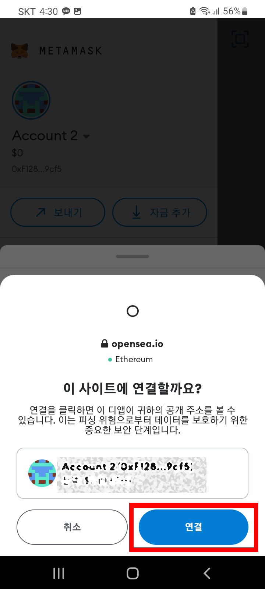

연결을 눌러줍니다.&#x20;

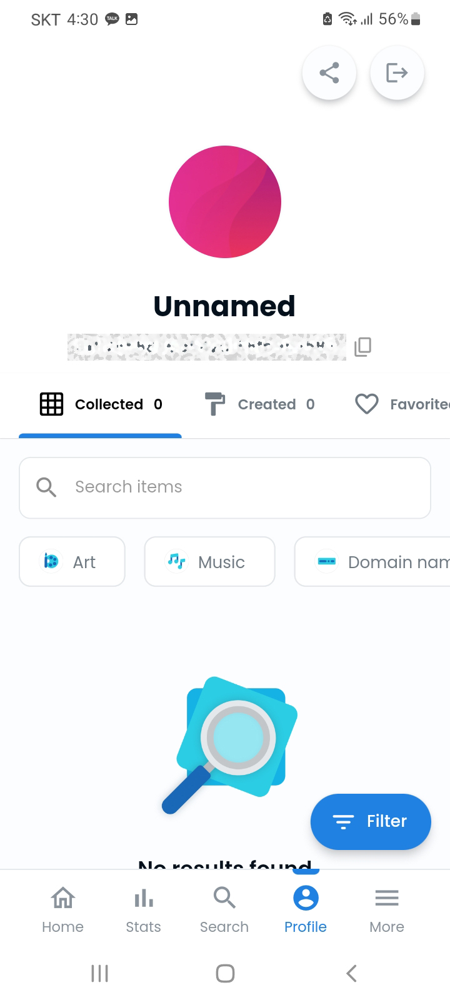

연결되었습니다. 이제 보유한NFT를 확인하실 수 있습니다.    &#x20;
