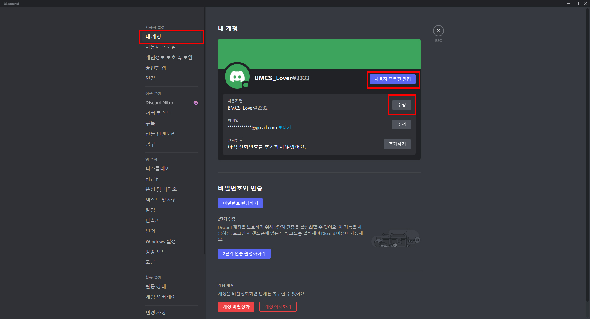
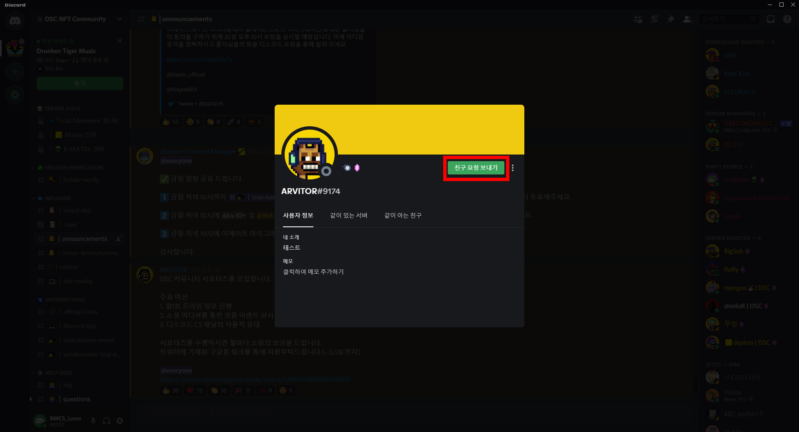

# 디스코드 사용가이드 1

### 1. 디스코드 메인

디스코드의 기본 화면입니다. 좌측에는 DSC 디스코드 서버의 채널 목록이, 맨 좌측에는현재 계정이 참가 중인 디스코드 서버를 확인할수 있습니다.  &#x20;

화살표를 눌러 채널목록을 축소할 수 있습니다.  &#x20;

닉네임의 색은 유저에게 부여된 '역할'에 따라 다릅니다. 오른쪽에 디스코드 서버 참여자들을 역할 별로정렬하여 나타낸 리스트가 있습니다.  &#x20;

닉네임 옆 프로필 사진을 클릭하면 해당 유저에게 부여된 역할을 확인할 수 있습니다. &#x20;

### 2. 디스코드 알림 설정

좌측하단의 설정아이콘을 누르면 디스코드 설정을 들어갈 수 있습니다.

알림을 선택하여 네모 표시된 항목들을 눌러 알림 해제를 해 줍니다. 위 네 가지 항목만 해제해도 무의미한 알림음은 울리지 않게 됩니다.    &#x20;

### 3. DM 차단기능&#x20;

.jpg>)

디스코드에서 오는 DM은 대부분 스캠입니다. 해당 기능을 비활성화 시키면, DM의 스캠 위험을 원천 차단해줍니다. 설정의 개인정보 보호 및 보안에서 다이렉트 메세지 허용을 해제할 수 있습니다.      &#x20;

### 4. 프로필 편집 &#x20;

설정을 들어가 좌측에서 내 계정을 누릅니다. 사용자명 옆의 수정 버튼을 통하여 닉네임을 바꿀 수 있습니다. 프로필 사진을 바꾸고 싶다면 '사용자 프로필 편집'을 누릅니다.       &#x20;

아바타(프로필 사진)와 프로필 배경색을 선택하여 변경할 수 있습니다.  &#x20;

### 5. 디스코드 친구 추가 &#x20;

#### 1) 프로필을 통하여 신청하기&#x20;

친구 신청을 원하는 대상의 프로필 사진을 누릅니다.  &#x20;

친구 요청 보내기를 누릅니다.&#x20;

#### 2) 사용자명을 통해 검색&#x20;

친구의 사용자명을 받습니다. 사용자명은 OOOO#1234의 형태를 띠고 있습니다. &#x20;

사용자명을 입력하고 친구 요청을 보냅니다.&#x20;
