# 디스코드 사용가이드 2

### 1. 디스코드 서버로 초대&#x20;

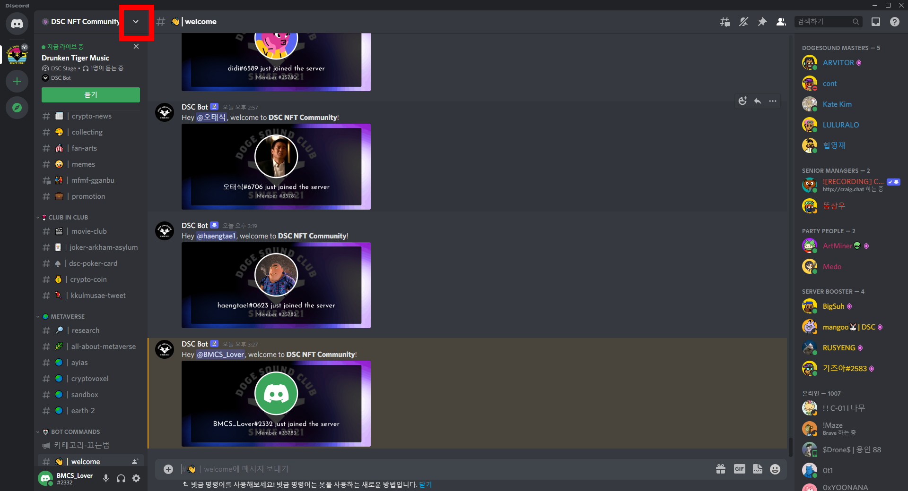

다른 사람을 DSC 커뮤니티로 초대하는 방법입니다. 좌측 상단의 서버 이름 옆 화살표를 눌러줍니다.   &#x20;

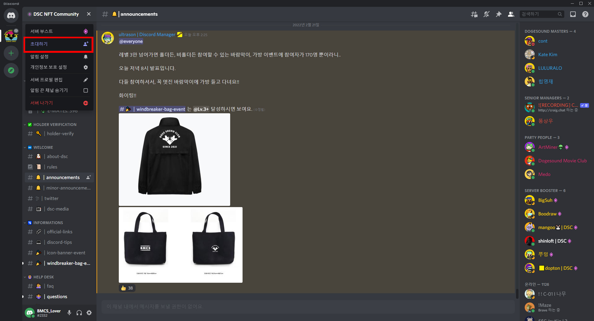

초대하기를 눌러줍니다. &#x20;

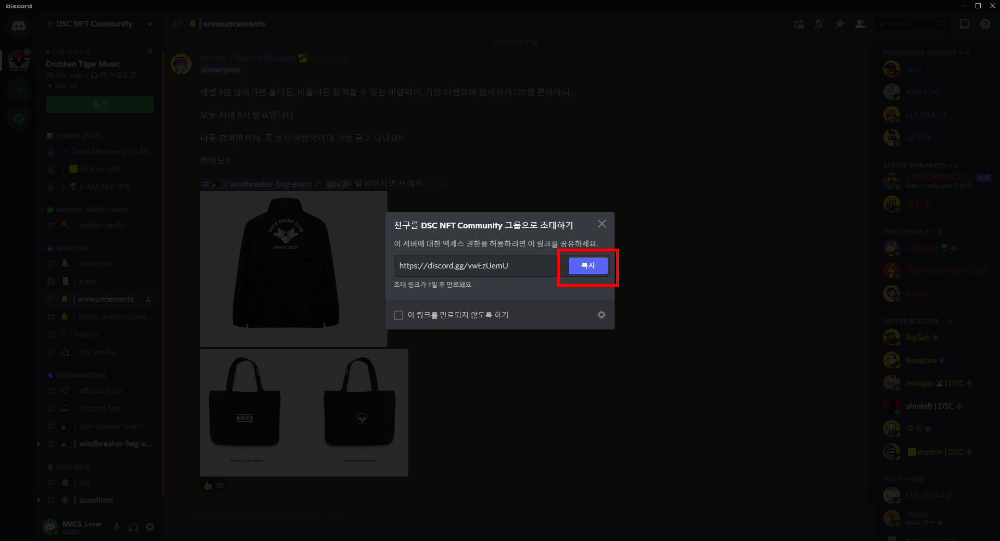

복사를 누르면 개인 초대 링크가 복사됩니다.  &#x20;

### 2. 화면 공유하는 법  &#x20;

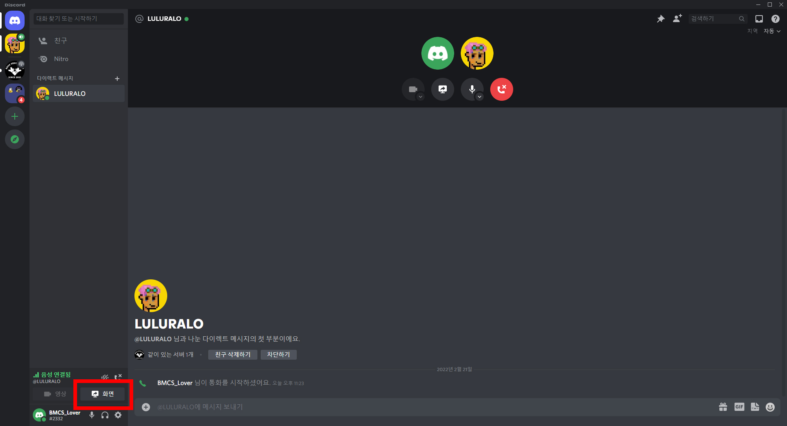

화면공유 기능은 화면공유가 가능한 채널에 들어가면 활성화됩니다. 화면 버튼을 눌러봅니다.

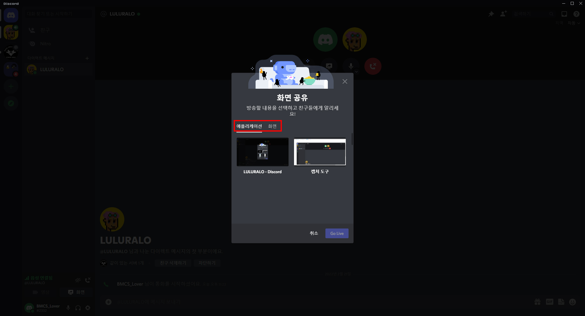

애플리케이션과 화면을 선택할 수 있습니다. 애플리케이션은 특정 프로그램만 보여줍니다. 화면은 화면 전체를 공유합니다.&#x20;

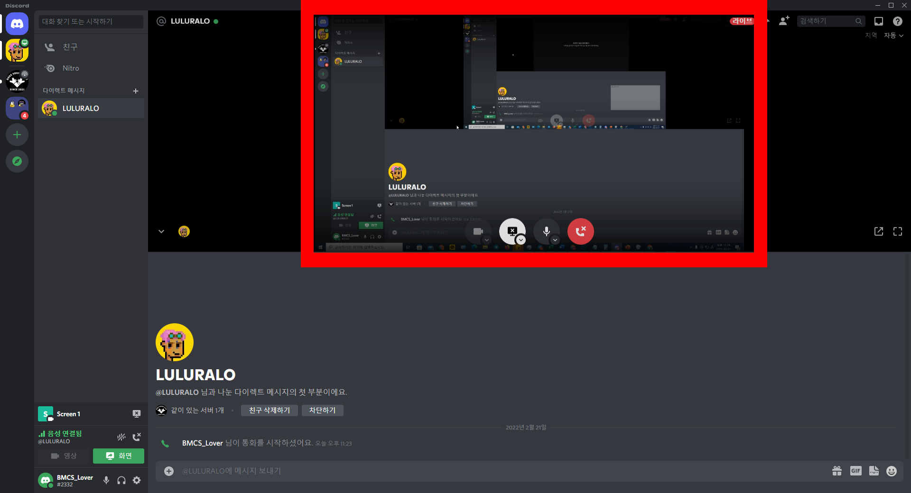

공유된 화면을 눌러 다른 맴버가 공유한 화면을 볼 수도 있습니다.&#x20;

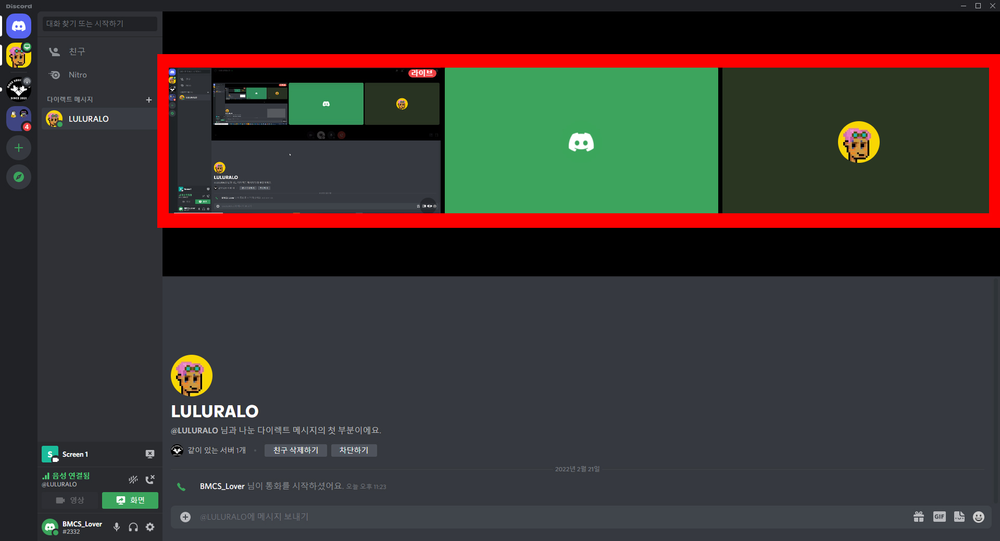

다른 맴버들도 화면 공유를 하고 있다면 목록에 뜹니다. 좌측 하단의 방송중지 아이콘을 눌러 방송을 종료할 수 있습니다.    &#x20;

### 3. 음소거 / 헤드셋 음소거 기능&#x20;

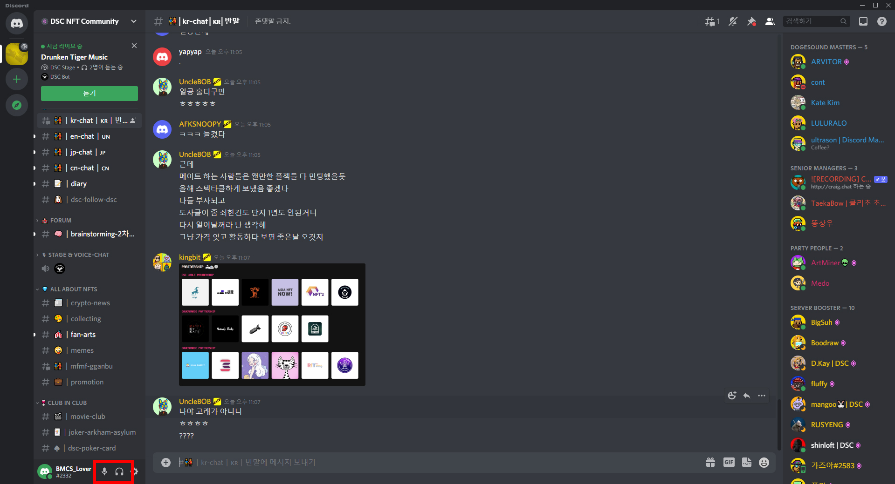

좌측 하단의 마이크와 헤드셋 아이콘을 클릭하면 각각 마이크 / 스피커를 비활성화할 수 있습니다.      &#x20;

### 4. 고정메세지 확인&#x20;

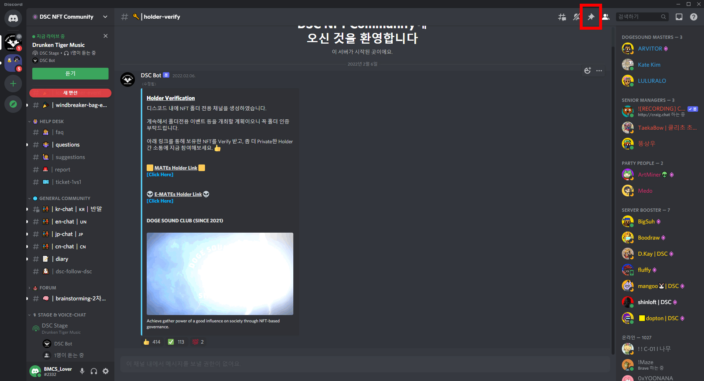

고정 메세지는 해당 채널에서 중요한 전달사항 등을 고정해 두는 공간입니다. 우측 상단의 압정 아이콘을 눌러줍니다.     &#x20;

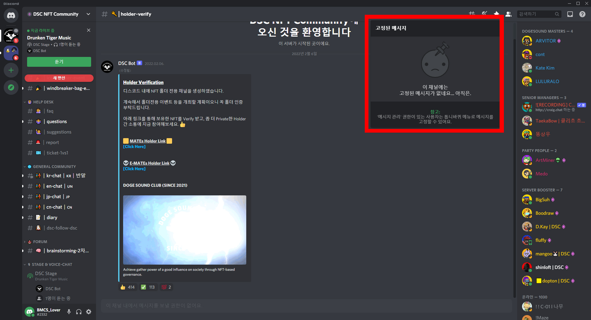

고정된 메세지들을 확인할 수 있습니다. &#x20;

### 5. 검색 기능 &#x20;

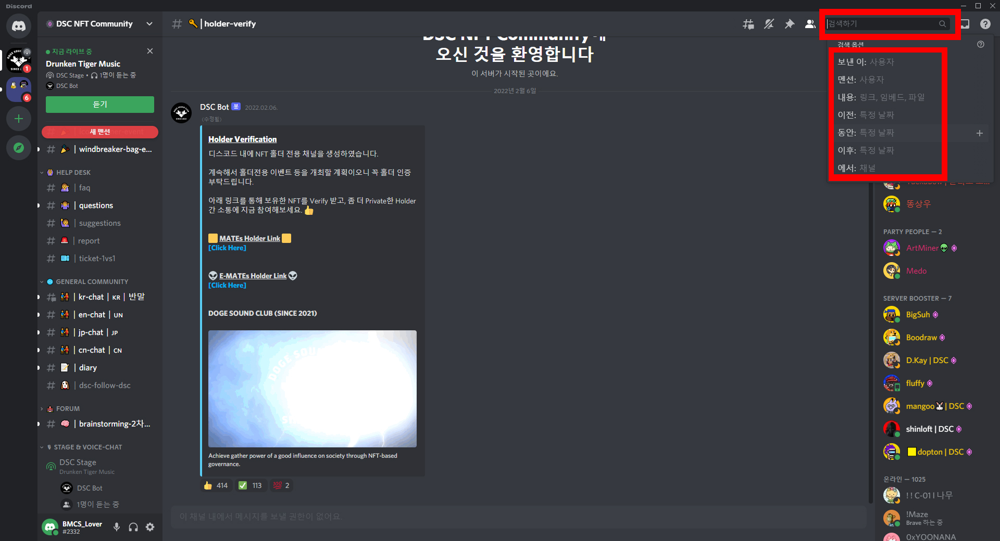

검색 기능은 채팅을 찾을 때 유용합니다. 우측 상단의 검색창을 클릭합니다. 하단에서 명령어를 선택합니다.      &#x20;

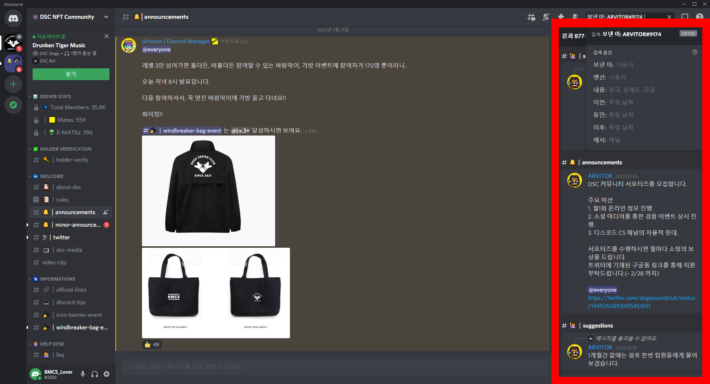

보낸 이를 선택하여 아비터님이 보낸 채팅을 검색합니다. 우측에서 확인할 수 있습니다.    &#x20;
