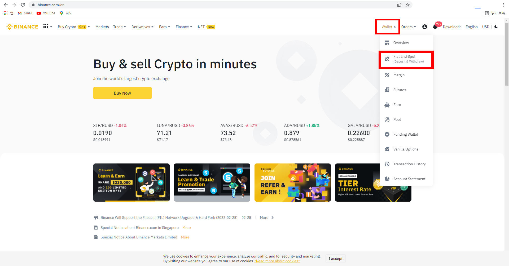

# 카이카스에 클레이 입금하기

현재 ‘트레블룰’로 인하여 빗썸계좌에서 등록되지 않은 주소로 클레이 송금이 불가능합니다.

클레이를 송금하기 위해서는 클레이를 수령할 지갑주소를 빗썸계좌에 등록해야하며 이를 위해서는 클레이를 수령할 지갑이 본인의 소유라는 것을 증명해야 합니다.

여기서 문제가 발생합니다.

빗썸에서 클레이를 카이카스로 송금하기 위해서는 카이카스가 본인의 소유라는 인증해야하는데 카이카스는 KYC인증이 없기때문에 지갑이 본인의 소유라는것을 인증할 수 없습니다.

이를 인증하기 위해서는 카이카스가 설치되어 있는 전자기기(노트북, PC 등)를 지참하고 빗썸 본사(서울 서초구에 위치)에 방문하여 대면심사를 받아야합니다.

하지만 이 방법은 매우 제약이 많은 방법입니다.

그렇게 때문에 KYC인증이 되어있어 본인 증명을 할 수 있는 해외거래소 '바이낸스'를 통하여 클레이를 카이카스까지옮기는 방법에 대해설명드리겠습니다.     &#x20;

&#x20;

## 1. 빗썸 계좌에서 바이낸스 주소 등록하기&#x20;

### -빗썸 출금주소관리

우선 빗썸에서 출금주소 등록을 해 줘야 합니다.

.png>)

빗썸의 입출금 탭에서 우측상단 출금주소관리를 눌러 줍니다.

.png>)

출금주소 선택창이 뜹니다. 주소를 추가해야 합니다. 주소 추가를 눌러줍니다

.png>)

메인넷을 선택하여야 합니다.

비트코인 메인넷을 눌러 Klaytn 메인넷으로 바꾸어 줍니다.

### -바이낸스에서 입금주소 가져오기&#x20;

Binance에서 Klaytn체인의 입금주소를 가져와야 합니다.

Binance를 켜서 로그인을 해 줍니다.

우측 상단의 Wallet 메뉴에서 Fiat and Spot을 선택합니다.

.png>)

Klay를 검색하여 찾은 후 Deposit을 클릭합니다.

.png>)

주소를 복사하여 줍니다.

.png>)

다시 빗썸으로 돌아와 복사한 주소를 붙여넣어줍니다.

주소의 별칭또한 알아보기 쉽게 정한 다음 다음을 눌러줍니다.

###

## 2. 바이낸스 주소 인증하기 &#x20;

### -거래소선택&#x20;

####

.png>)

아래로 내려 바이낸스를 찾아 선택해 줍니다.

### -사진 찍기

.png>)

해당 주소가 본인의 바이낸스 주소가 맞는지에 대한 증명을 해야합니다.

증명은 사진으로 합니다.

.png>)사진 예시

지갑주소 + 본인 신분증 & 바이낸스 회원정보 + 본인 신분증이 들어가 있는 사진을 찍은 뒤 제출해야 합니다.

\*\*\*신분증의 주민번호 뒷자리, 발급일자가 가려져 있어야 합니다.

### -사진1

아까 바이낸스 주소를 복사했던 창으로 돌아가 바이낸스 클레이튼 주소와 함께 신분증과 함께 사진을 찍습니다.

### -사진2

.png>)

계정란의 Security를 선택해 줍니다.

.png>)

전화번호와 E-mail이 일부공개 상태로 나와있습니다. 이 두가지정보 + 신분증이 보이도록 사진을 한장 더 찍어줍니다.

### -사진3

.png>)

이번엔 Wallet에서 Account Statement로 갑니다.

.png>)

계정의 E-mail + 신분증이 잘 보이도록 다시한번 사진을 찍어줍니다.

\*\*\*바이낸스의 E-mail과 빗썸의 E-mail이 같아야 합니다.

&#x20;

### -제출 및 심사

3장의 사진을 등록한 뒤 제출합니다.

.png>)

심사에 들어갔습니다.

빠르면 5분내로 결과가 나옵니다.

## 3. 빗썸 -> 바이낸스 -> 카이카스 송금&#x20;

### 빗썸 -> 바이낸스 송금

.png>)

주소등록이 완료되면 바이낸스로 출금이 가능해집니다. ARS인증을 진행하고 출금해줍니다.

####

### 바이낸스 -> 카이카스 송금&#x20;

.png>)

바이낸스로 Klay가 입금되었습니다. 입금을 확인하고 Withdraw버튼을 눌러줍니다.

.png>)

카이카스 지갑주소와 수량을 적고 withdraw를 눌러 출금해줍니다.
