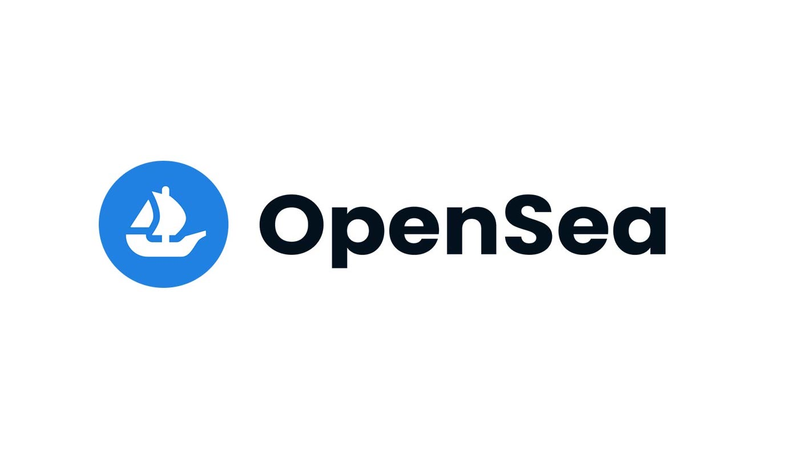

# 오픈씨에서 메이트 구매하기

## OpensSea 란?

오픈씨는 전세계 최대 NFT마켓플레이스입니다. NFT 2차거래가 활발하게 이루어지고있으며 DSC메이트 역시 오픈씨에서 구매하실 수 있습니다.   &#x20;

### 1. 오픈씨접속  &#x20;

오픈씨 링크 : [https://opensea.io/](https://opensea.io/) &#x20;

### 2. 카이카스지갑 연결  &#x20;

오픈씨에 로그인하시려면 개인지갑을 연결하셔야합니다. 이더리움 기반 NFT는 메타마스크를 클레이튼 기반 NFT는 카이카스를 연결해주시면 됩니다.&#x20;

메이트는 클레이튼 기반이기 때문에 카이카스를 선택해줍니다.    &#x20;

### 3. DSC 검색 &#x20;

DSC MATES | DIGITAL IDENTITY을 검색하여 줍니다.&#x20;

### 4. 메이트 구매하기&#x20;

이제 메이트를 구매해볼 차례입니다. 마음에 드는 메이트를 찾아 BUY NOW를 클릭합니다.   &#x20;

### \*구매절차

### 1) 자금입금 : 내 지갑에 클레이를 입금합니다.  &#x20;

### 2) 클레이 -> 위클레이 변환

Klay를 wklay로 변환해줍니다.   &#x20;

 

### 3) 해당 NFT프로젝트 첫 거래승인

해당 프로젝트의 첫거래를 승인합니다. (프로젝트 당 1번)       &#x20;

 

### 4) 최종 거래승인&#x20;

최종승인을하여 메이트를 구매합니다.   &#x20;

 
