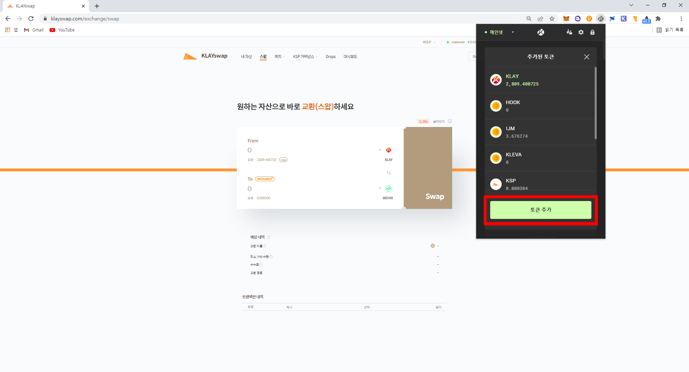
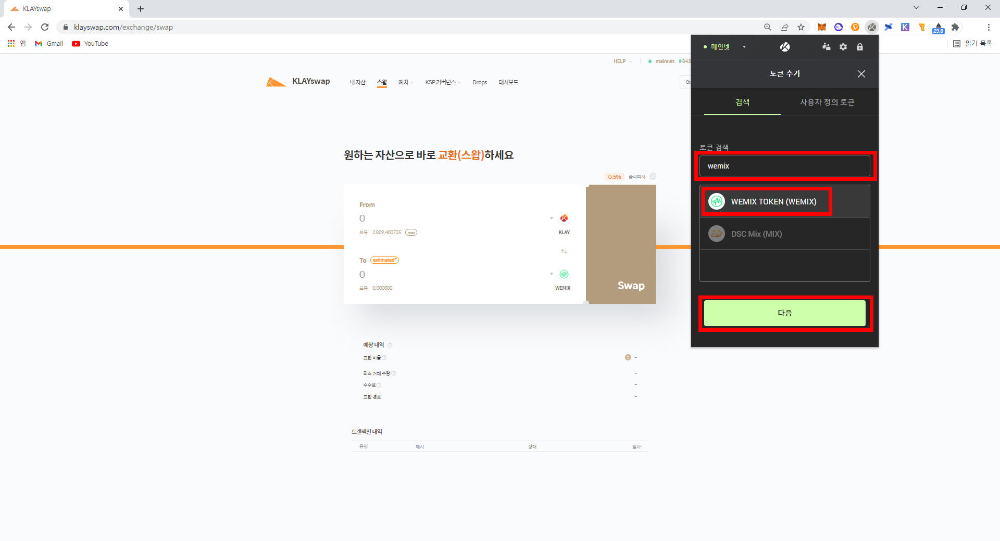
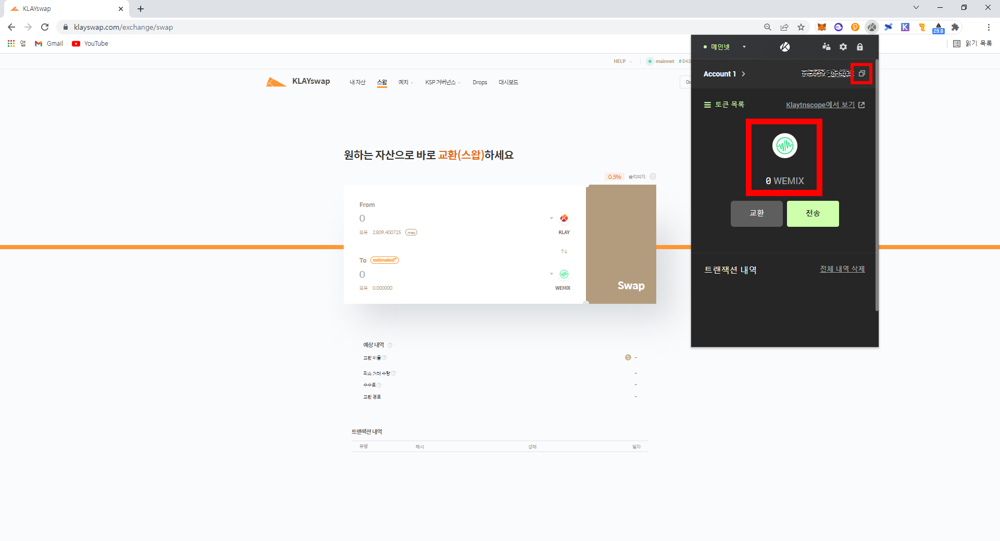
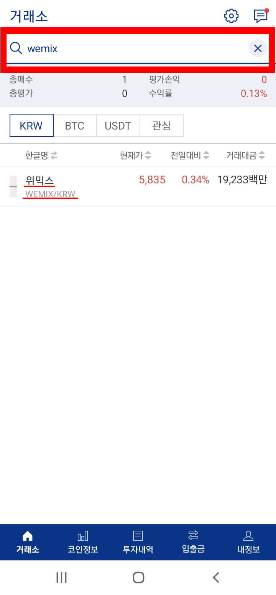
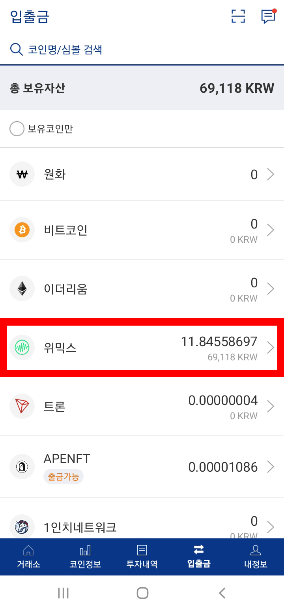
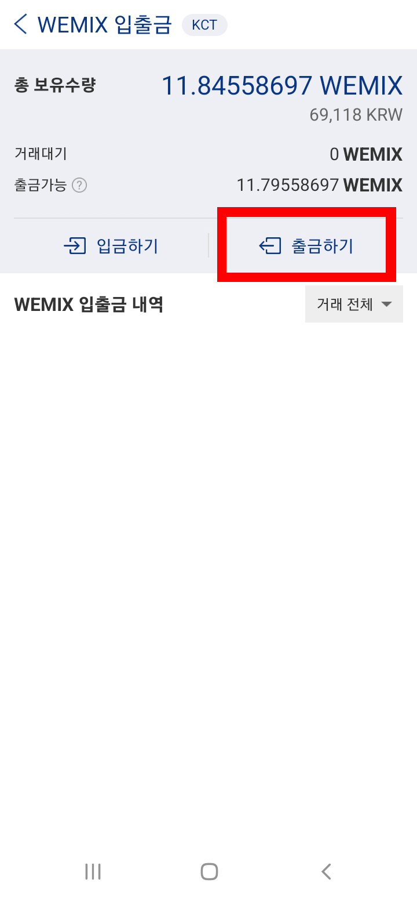
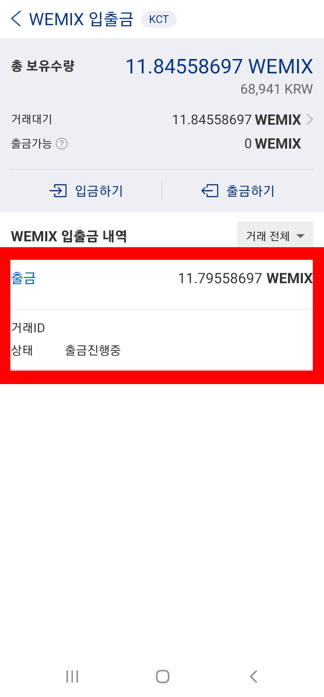
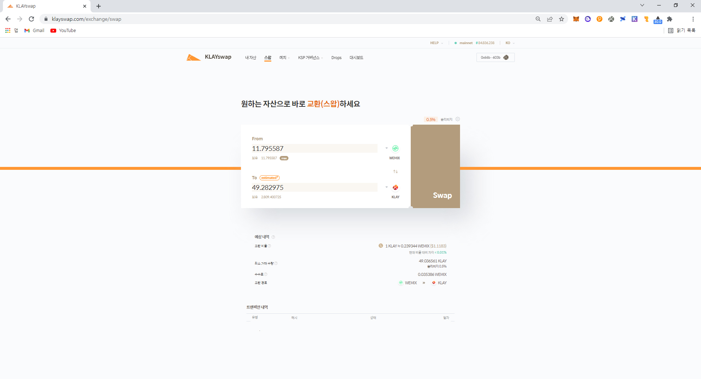
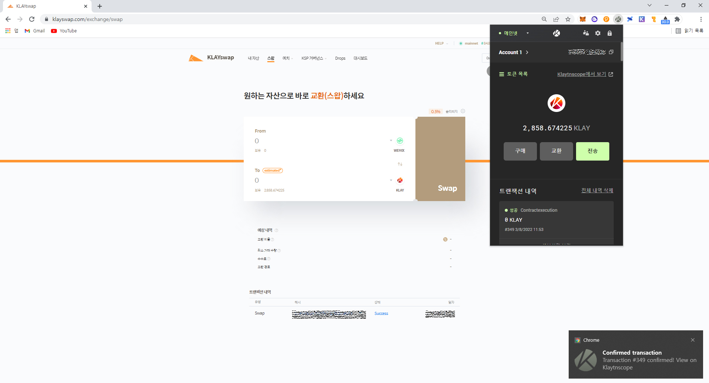

# 카이카스에 클레이 입금하기(wemix)

업비트에서 위믹스(WEMIX)를 산 뒤 카이카스로 전송하여 WEMIX -> KLAY 스왑을 하는 과정을 알아볼 것 입니다.

위 과정은 업비트에서 위믹스(WEMIX)대신 리플(XRP)을 구매하여 진행할 수 도 있습니다.

### 1. 클레이스왑에 WEMIX 추가하기&#x20;

Klayswap을 들어가줍니다.  &#x20;



#### 1-1.토큰목록에 WEMIX 추가

.jpg>)

&#x20;

\*\*리플을 사용한 경우에는 XRP를 검색하여 \[Orbit Bridge Klaytn Ripple(KXRP)]를 선택해 줍니다.

&#x20;

카이카스 지갑주소를 복사하여줍니다. &#x20;

### 2. 위믹스 업비트-> 카이카스로 전송  &#x20;

#### 2-1. WEMIX 구매

업비트에서 WEMIX를 검색하여 구매해줍니다. &#x20;

위믹스가 구입되어있습니다.

#### 2-2. WEMIX를 업비트-> 카이카스로 송금&#x20;

#### WEMIX 출금

   출금하기를 눌러줍니다.

.jpg>)출금주소란에 아까 복사하였던 카이카스주소를 넣어줍니다.

출금신청을 누르면 카카오톡으로인증메시지가 옵니다.

카카오톡으로 오는 인증메시지를 확인하고 인증하여줍니다.  &#x20;

#### WEMIX 출금 확인

출금이 진행중입니다.

잠시 기다리면 카이카스에서 확인할 수 있습니다.

### 3. Klayswap에서 WEMIX -> KLAY로 스왑하기&#x20;

.jpg>)

&#x20;

