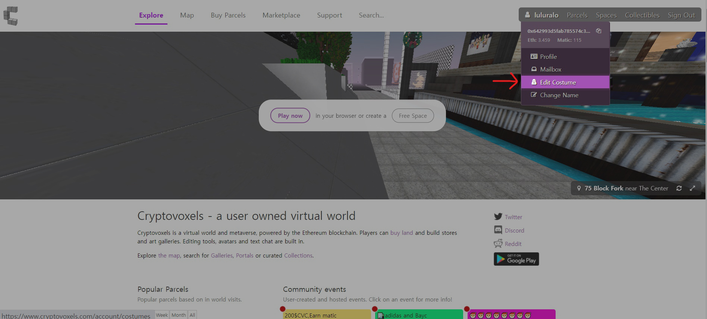
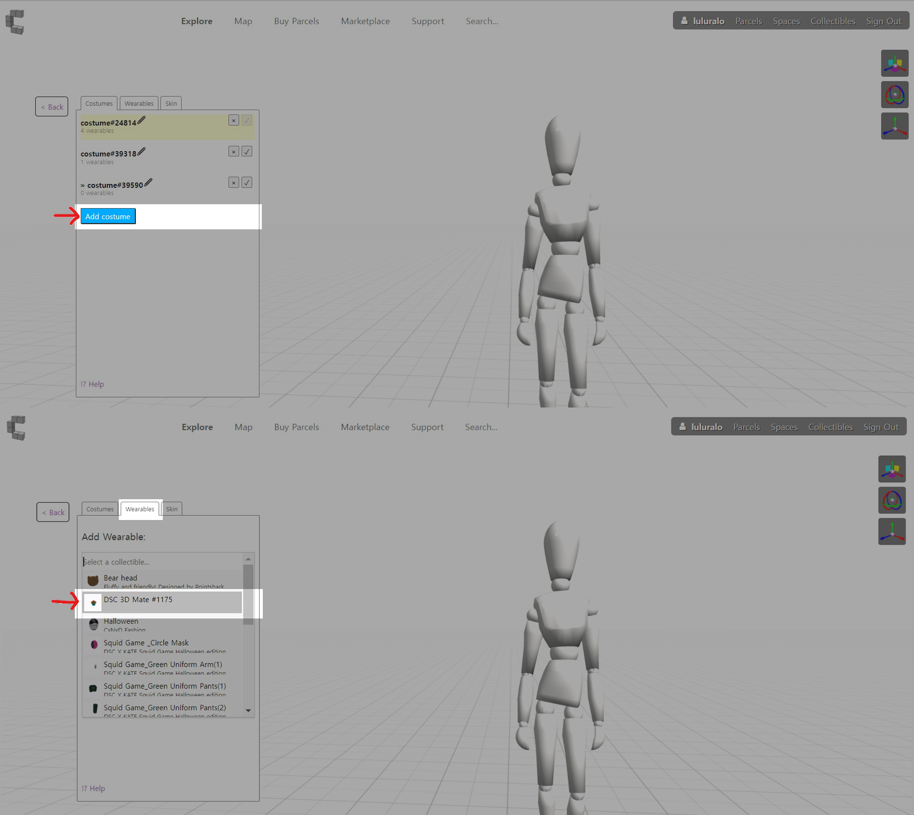

# DSC 3D Mate 착용 가이드

안녕하세요 릅릅입니다.

DSC V1 Mates가 있으신 분이라면 모두 지갑에 3D 메이트 복셀 파츠를 에어드랍 받으셨을거에요.&#x20;

> ## [Kaikas에서  Metamask로 이동하기](https://medium.com/dogesoundclub/%EC%97%B0%EB%A7%90%ED%8C%8C%ED%8B%B0%EC%9A%A9-3d-mate-%EC%97%90%EC%96%B4%EB%93%9C%EB%9E%8D%EC%95%88%EB%82%B4-%EC%B9%B4%EC%9D%B4%EC%B9%B4%EC%8A%A4%EC%A7%80%EA%B0%91-%EB%A9%94%ED%83%80%EB%A7%88%EC%8A%A4%ED%81%AC%EB%A1%9C-%EB%82%B4%EB%B3%B4%EB%82%B4%EA%B8%B0-33346916c10d)&#x20;

홀더 여러분들의 DSC 3D Mate를 31일에 있을 연말파티에 멋지게 착용해주시고 오시면 됩니다!&#x20;

하지만 아직 크립토복셀이 어색하신 분들이 계실거에요.&#x20;

메이트 웨어러블을 크립토복셀 속 내 캐릭터에 올바르게 장착하는 법을 안내해드리도록 하겠습니다.

&#x20;웨어러블에 대한 자세한설명은 아래 페이즈를 참고해주시면 됩니다. &#x20;


[step2.md](step2.md)


## Add costume

우선 크립토 복셀 홈페이지에 3D 메이트를 수령한 메타마스크 계정으로 연결하신 후&#x20;

우측상단에 **Edit costume**을 눌러줍니다.

**Add costume**을 눌러주시면 하얀색 목각인형이 보이실거에요.&#x20;

**Wearable** 카테고리에서 3D 메이트를 찾아서 장착해줍니다 .

&#x20;

## Open editor

3D 메이트를 눌러주시면 아래의 사진처럼 메이트 아이템이 머리 안에 들어 있을거에요.&#x20;

이대로 파티에 갈수는 없겠죠? 직접 조정을 해주어야 합니다. &#x20;

.jpg>)

우측 상단의 3가지 에디트 툴들을 활용하여 머리에 맞게 조정해줍니다.&#x20;

수정이 필요한 아이템을 선택한 뒤 에디트 툴들을 누르면 수정이 가능해요.&#x20;

**open editor**를 누르고 아래 사진과 같이 수치를 조정해줍니다.

* <mark style="color:red;">**Position : -0.011 / -0.028 / 0.007**</mark>
* <mark style="color:red;">**Rotation :  0 / 360 / 0**</mark>
* <mark style="color:red;">**Scale :  1.2 / 1.2 / 1.2**</mark>

&#x20;

## Skin

****

크기는 맞게 조정하였지만 목부분이 튀어나와 살짝 거슬리죠?&#x20;

Skin 카테고리에서 **Neck joint**를 클릭해줍니다.&#x20;

Neck joint를 누르신 후 왼쪽 체크마크를 해제해주면 해당 부위가 투명해집니다.

.jpg>)

**튀어나온 부분까지 정리해주었으면 나만의 3D 복셀 메이트 준비 완료!**

