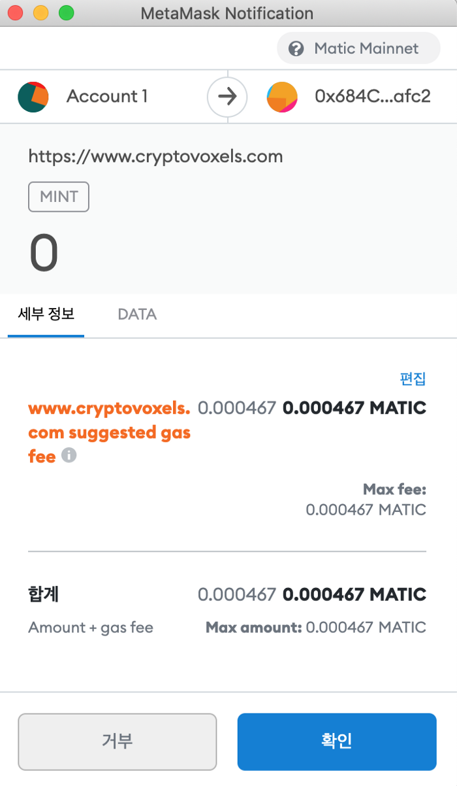

# 나만의 이름 설정

안녕하세요! 여러분의 크립토복셀 안내자! 케이트입니다 :)

많은 분들이 크립토복셀에 들어가시면 가장 불편하다고 느껴지시는 점이,&#x20;

누가 누구인지 알아볼 수 없다는 점일 거예요. 아무래도 처음 오신 분들은 이름이 아닌&#x20;

지갑 주소가 머리 위에 뜨고, 아바타도 전부 같은 흰색 목각 인형이니 구분이 잘 가지 않더라구요.

그래서 오늘은! 여러분을 위해 ‘이름 설정하는 방법'을 알려드리려 왔습니다 :)

먼저 필요한 것은 ‘매틱(구 폴리곤)’ 이라는 화폐인데요, 매틱을 구하는 것이 한국에서는 참 어렵습니다.

일단 여러분의 지갑에 매틱 메인넷을 추가하는 방법부터 먼저 알려드리겠습니다.&#x20;

그런 다음, 매틱을 어떻게 구하는지도 알려드릴게요.

## **메타마스크에 Matic Mainnet 추가하기** 

1. 메타마스크 상단의 ‘이더리움 메인넷' 을 클릭한 뒤, \
   하단에 있는 ‘맞춤형 RPC’를 클릭합니다. (영문 버전은 Custom RPC 를 클릭하시면 됩니다)

2\. 이제 빈 칸을 아래와 같이 채워 주시면 됩니다.

* 네트워크 이름 (Network Name) : Matic Mainnet
* 새 RPC URL(New RPC URL) : [https://rpc-mainnet.matic.network](https://rpc-mainnet.matic.network/)
* 체인 아이디(Chain ID) : 137
* 통화 기호 (Symbol) : MATIC
* 블록 탐색기 URL (Block Explorer URL) : [https://explorer.matic.network/](https://explorer.matic.network/)

다 채워 주셨나요? 하단의 ‘저장' 버튼을 눌러 네트워크를 추가해 주시면 됩니다.

3\. 그렇다면 위와 같이, ‘이더리움 메인넷' 을 클릭하여 네트워크 목록을 조회할 때 ‘Matic Mainnet’ 을 \
확인하실 수 있습니다. 매틱 메인넷을 클릭한 다음, 보유하신 매틱을 확인해 주세요.

## 매틱 구매하기 

바이낸스 ([https://www.binance.com/en](https://www.binance.com/en))

* 바이낸스에서 매틱을 직접 구매할 수 있습니다. 구매하신 매틱을 여러분의 지갑 속 매틱 메인넷으로 전송하기 위해서는, 송금 전에 네트워크를 ‘폴리곤 네트워크' 로 선택하신 후 송금하셔야 합니다. 다만, 폴리곤 네트워크가 가끔 느리게 작동하여 송금 과정이 느릴 수 있습니다.
* 국내에서도 매틱을 구입할 수 있습니다. 빗썸에서 구매 가능하십니다만, 매틱이 매틱 메인넷이 아닌 이더리움 메인넷으로 들어온다는 치명적인 단점이 있습니다. 이 경우 여러분은 폴리곤 브릿지([https://wallet.polygon.technology/bridge](https://wallet.polygon.technology/bridge))를 통해 구매하신 매틱을 이더리움 메인넷에서 폴리곤 메인넷으로 옮겨야 합니다. 이 때 수수료가 들어가는데, 이더리움 블록체인에서 부과하는 수수료라 요즘같이 가스피가 요동칠 때면 구입한 매틱보다 수수료가 더 비싼 사태가 벌어지기도 합니다.

## 이름 설정하기 

자, 오래 기다리셨습니다! 이제 지갑에 매틱 메인넷도 추가되었고,&#x20;

매틱도 준비되었으니 이제 이름을 바꾸러 갈 차례입니다. 절 잘 따라오세요!

세 번 정도 들어와서 이제 제법 익숙해진 크립토복셀 메인 화면입니다.&#x20;

오늘도 저 오른쪽 상단의 프로필에 들어가 보겠습니다.&#x20;

여러분에게는 아마 지갑 주소로 적혀 있을, 화이트 볼드체로 쓰여진 이름을 클릭해 주세요.

익숙한 트렌치 코트를 입은 아바타가 나타납니다 :)&#x20;

자, 이번에는 edit costume 이 아닌 edit name을 클릭할 차례입니다.&#x20;

(you)라고 쓰여진 이름 바로 아래, edit name 을 클릭해 주세요.

현재 이름 현황이 나오고, Advanced.. 버튼을 클릭하면 이렇게 이름을 만들 수 있는 창이 열립니다.&#x20;

크립토복셀 세계의 좋은 점은, 아바타의 의상을 여러 개 설정할 수 있다는 점과&#x20;

더불어 여러 개의 이름을 사용할 수 있다는 점입니다!&#x20;

저도 Kate Kim이라는 이름과 Katekitkatkitty라는 이름을 동시에 사용하고 있습니다.

이름을 바꾸는 방법은 굉장히 간단합니다. 여러분이 원하시는 이름을 빈 칸에 쓰고,&#x20;

register name을 클릭하면 된답니다!&#x20;

저는 도사클을 사랑하는 마음으로 IloveDSC라는 이름을 가져보기로 했습니다.

이 과정은 사실 수수료가 드는데, 매우 지극히 아주… 적은 금액입니다.&#x20;

제가 지금 글을 쓰고 있는 현재 1Matic이 1500원\~1600원 정도 하는데, 0.000467매틱이면..&#x20;

상당히 적은 금액이죠? 가스피를 확인하신 후 ‘확인' 을 눌러 주시면 됩니다.

그리고 나서 약 1분 가량을 기다리신 다음 하단의 리프레쉬 버튼을 누르면,&#x20;

여러분이 등록한 새 이름이 들어와 있는 것을 확인할 수 있습니다 :)&#x20;

유일한 단점이 있다면, 아직까지 폴리곤 체인의 속도가 조금 느려서 등록한 이름을 받아보실 때까지&#x20;

시간이 조금 걸릴 수 있다는 점입니다 ^^;&#x20;

트랜잭션이 이루어졌다면 이름은 언젠가 반드시 등록되니, 조금만 기다려 주세요!

이름을 적용하는 방법은 간단합니다. 변경하고 싶은 이름을 클릭해 주시면,&#x20;

saved! 라는 메세지가 하단에 나타납니다.

그럼 이렇게, 이름이 변경된답니다! 이름은 알파벳과 숫자만 허용되어서,

&#x20;여러분의 메이트 이름과 넘버를 써 주셔도 좋은 이름이 될 것 같아요 :)

지금까지 크립토복셀 족집게 강의를 보아주신 여러분께 감사 인사를 전합니다.

&#x20;멋지게 꾸민 도사클 회원님들을 복셀에서 자주 마주칠 수 있었으면 좋겠네요!&#x20;

그럼 저는 이만 글을 마치겠습니다. 여러분, 크립토복셀에서 만나요!
