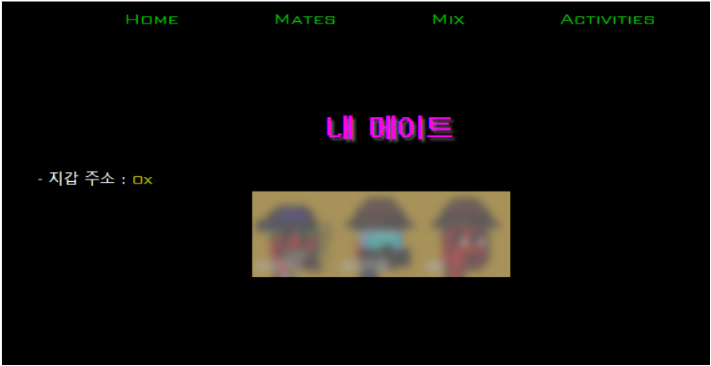

# 1. 메이트 이름 짓기

* [https://dogesound.club/](https://dogesound.club/) 에 접속합니다.
* 카이카스에 로그인 후, 'MATES' - '**내 메이트'**를 클릭합니다.&#x20;

.png>)

보유한 메이트 중 변경하고자하는 메이트 선택합니다.

* 이름을 짓거나 변경하고 싶은 메이트의 이름을 입력하고 제출하기 버튼을 눌러 보세요.

.png>)

* 메이트의 이름을 짓기 위해서는 10 MIX가 소모 됩니다.(삭제시에는 20 MIX)   &#x20;
* 클레이튼 블록체인에 데이터를 저장하기 위해 카이카스 지갑의 확인 버튼을 눌러 서명합니다.

* 222번 메이트에게 이름이 입력된 것을 확인할 수 있습니다.
* 아래는 DSC 홈페이지 갤러리에서 확인한 이름입니다.

* 오픈씨에서 확인하기 위해서는 한 가지 과정이 더 필요합니다 ! 이름을 지어준 메이트 아이템 페이지로 들어가서, 아래의 메타데이터 갱신 버튼(새로 고침과 모양이 비슷함.)을 눌러 주세요. 버튼을 누른 후, 1분 정도 기다리면 메타 데이터가 갱신되고 이름이 표시됩니다.

* 이름이 표시된 것을 알 수 있습니다 ! 다음으로 메이트 222, 라이카에게 메시지를 남겨 보겠습니다.
